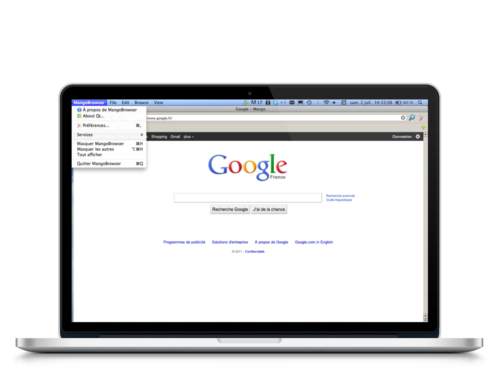

Mango
=====

Mango is a Web Browser built with Qt, based on WebKit and which has the main features a decent browser is supposed to have.

I built it as I was studying in Germany - even before I start studying Computer Science, and it was my first big project to achieve. The UI was designed with Qt (and thus uses C++), which allowed me to make it run on several platforms very easily.

Mango has the basic features you would expect from a browser: tab management, find in page, basic download manager as well as a few other stuff. I also created a website that's a bit more comprehensive about Mango.

You can have a look at the dedicated website here: http://thomaskeunebroek.fr/projects/mango/ to grab more information.
